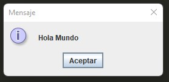

# Introducción a Java
 
1. [¿Qué es Java?](#¿Qué-es-Java?)
2. [Instalar JDK](#Instalar-JDK)
3. [Jshell](#jshell)
4. [Instalar Intellij IDEA](#Instalar-Intellij-IDEA)
5. [Hola Mundo con Java](#Hola-Mundo-con-Java )
6. [Compilación de un proyecto de Java](#Compilación-de-un-proyecto-de-Java)
7. [Mi primer método](#Mi-primer-método)
8. [Documentación del proyecto](#Documentación-del-proyecto)
 
---
## ¿Qué es Java?
Java es un lenguaje de programación moderno de alto nivel diseñado a principios de la década de 1990 por James Gosling de Sun Microsystems publicado 1995 y actualmente propiedad de Oracle.
- Java es independiente de la plataforma
- Java es portátil
- Robusto
- Dinámico
- Altamente Tipado
 
Java garantiza que podrá escribir una vez, ejecutar en cualquier lugar.
### ¿Qué aplicaciones puedo desarrollar con Java?
- Java se utiliza para desarrollar aplicaciones para el sistema operativo Android de Google
- Aplicaciones de escritorio
- Aplicaciones web
- Aplicaciones empresariales (Como bancarias).
- Juegos
- Etc.
 
### Pasos de desarrollo con Java
- Desarrolla la aplicación con lenguaje Java
    - Una aplicación escrito en Java tiene un extensión `.java` -
    `App.java`
    ~~~java
        import javax.swing.*;
 
        public class App {
 
            public static void main(String[] args) {
 
                JOptionPane.showMessageDialog(null, "Hola Mundo");
       
            }
        }
    ~~~
   
- Compila la aplicación a código Bytecode con extensión `.class` - `App.class`
    ~~~
    cafe babe 0000 003d 001c 0a00 0200 0307
    0004 0c00 0500 0601 0010 6a61 7661 2f6c
    ...
    ...
    0700 0600 0900 1300 0000 0c00 0100 0000
    0700 1800 1900 0000 0100 1a00 0000 0200
    1b
    ~~~
- Ejecuta la aplicación
    - Al ejecutar la aplicación será interpretado el código Bytecode a lenguaje máquina gracias a la máquina virtual de Java.
   
    
### Más sobre Java
- Ma sobre Java: https://www.oracle.com/java
- Tegnogias de Java: https://www.oracle.com/java/technologies/
- Certificación en Java de Oracle: https://education.oracle.com/es/oracle-certification-path/pFamily_48
- Lenguajes mas usados: https://www.tiobe.com/tiobe-index/
- Encuesta sobre Java: https://www.jetbrains.com/es-es/lp/devecosystem-2021/java/
- Licencia de Oracle: https://www.oracle.com/corporate/pricing/
 
---
## Instalar JDK
### ¿Qué es JDK?
JDK (Java Development Kit ) – Herramienta de desarrollo de Java
- JRE - Java Runtime Environment - (JVM)
- Compilador de Java
- Api de  Java
 
### Versiones de JDK
- Oracle JDK: https://www.oracle.com/java/technologies/downloads/
- OpenJDK: https://adoptium.net/
- Licencia de Oracle: https://www.oracle.com/corporate/pricing/
 
### Instalar Open JDK en  Linux
Verificar si tiene instalado Java en su ordenador:
~~~
java --version
~~~
 
Buscar en los repositorios de la distribución de Linux como Ubuntu el OpenJDK para instalar de el repositorio:
~~~
sudo apt-cache search openjdk
~~~
 
Instalar OpenJDK 17 con el siguiente comando.
 
~~~
sudo apt-get install openjdk-17-jdk
~~~
 
Comprobar la versión de JDK que tiene instalado ahora `java --version`.
 
---
## Jshell
La herramienta jshell te permite ejecutar código Java, obteniendo resultados inmediatos.
- Puede ingresar una definición de Java (variable, método, clase, etc.), como: int x = 8 o una expresión Java, como: x + x o una declaración o importación de Java.
- Estos pequeños fragmentos de código Java se denominan "snippets".
- También están los comandos de la herramienta jshell que le permiten comprender y controlar lo que estás haciendo, cómo: / list
 
- Para una lista de comandos: /help
 
---
## Instalar Intellij IDEA
IntelliJ IDEA es un entorno de desarrollo integrado (IDE) para el desarrollo de programas informáticos.
 
- Pagina oficial de Intellij IDEA: https://www.jetbrains.com/es-es/idea/download/
 
---
## Hola Mundo con Java
Comencemos por crear un programa simple que imprime "Hola Mundo" en la pantalla.
- En Java, cada línea de código que realmente se puede ejecutar debe estar dentro de una clase .
- En nuestro ejemplo, llamamos a la clase HolaMundo. Aprenderá más sobre las clases en las próximas secciones.
- En Java, cada aplicación tiene un punto de entrada o punto de partida, que es un método llamado main.
 
~~~java
public class HolaMundo{
    public static void main(String[] args){
        System.out.println("Hola Mundo");
    }
}
~~~
 
- `public` : cualquiera puede acceder a él
- `static` : el método se puede ejecutar sin crear una instancia de la clase que contiene el método principal
- `void` : el método no devuelve ningún valor
- `main` : el nombre del método.
 
---
## Compilación de un proyecto de Java
 
Compilar de `HolaMundo.java` a Bytecode que seria `HolaMundo.class`.
 
~~~
javac HolaMundo.java
~~~
 
Ejecutar el archivo compilado
 
~~~
java HolaMundo.class
~~~
 
---
## Mi primer método  
 
~~~java
public class HolaMundo{
    public static void main(String[] args){
        System.out.println("Hola Mundo");
    }
 
    //Mi método saludar
    static void saludar(){
        System.out.println("Hola desde saludar");
    }
}
 
~~~
 
---
## Documentación del proyecto
Agregar comentarios a medida que escribe el código es una buena práctica, ya que brindan aclaración y comprensión cuando necesita volver a consultarlo, así como para otras personas que puedan necesitar leerlo.
 
- Para comentarios de una línea `//`
- Comentarios de varias líneas se abre con `/*` y se cierra con `*/`
- Comentarios de documentación `/** ` y se cierra con `*/`
 
Javadoc es una herramienta que viene con JDK y se usa para generar documentación de código Java en formato HTML a partir del código fuente de Java que tiene la documentación requerida en un formato predefinido. Cuando un comentario de documentación comienza con más de dos asteriscos, Javadoc asume que desea crear un "cuadro" alrededor del comentario en el código fuente. Simplemente ignora los asteriscos adicionales.
 
 
 

